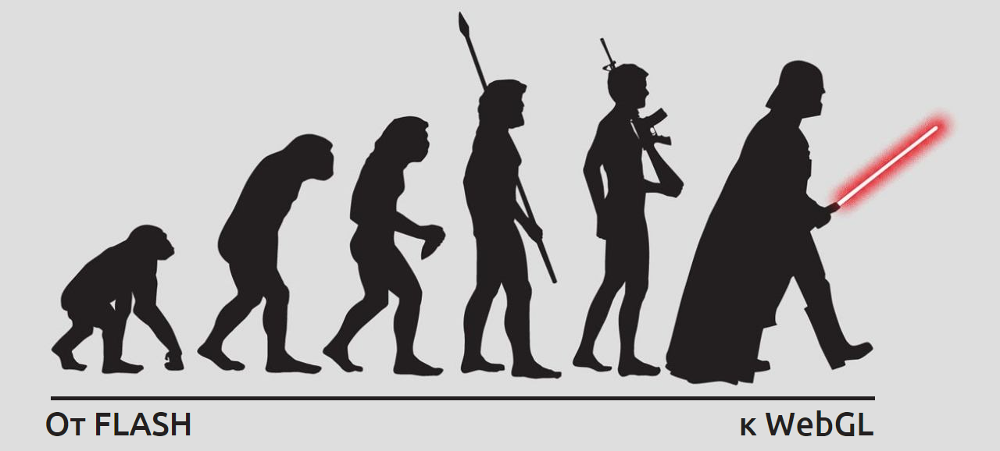
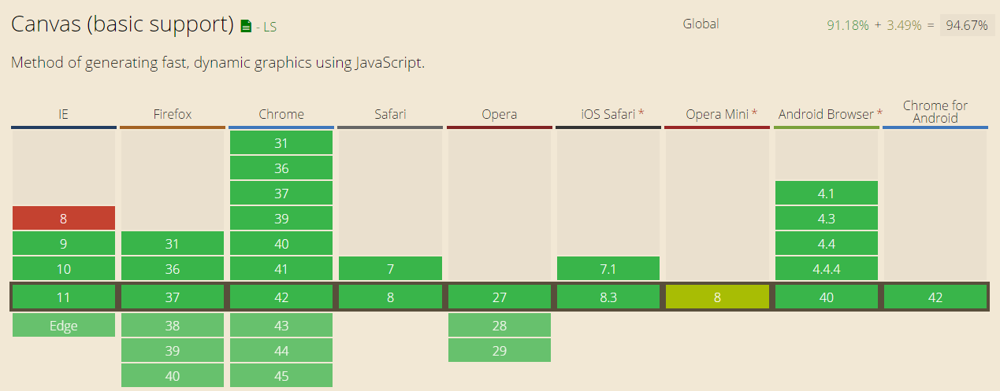
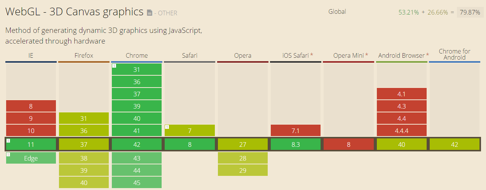

name: first_slide
# Three.js



---

## Перспективы 2D/3D в web-проектах ИД

- **информационная** функция: инфографика, графики и диаграммы;
- **развлекательная** функция: мини-игры и онлайн квесты для спецпроектов, баннеры.

> Насколько мне видится, интерактивная графика может служить как для информационной (инфографика, графики и диаграммы) цели, так и для развлекательной (мини-игры и онлайн квесты для спецпроектов, баннеры) цели. Использовать WebGL для, например, рисования иконок несколько расточительно, тем более что для этого прекрасно служат другие технологии векторной графики: SVG, шрифты.

> У WebGL несколько другой масштаб и возможности. Об этом далее...

---

## WebGL, Three.js и jQuery

```javascript
WebGL !== Three.js && WebGL > Three.js
```

> Могу сразу заметить: несмотря на то, что сегодня мы будем рассматривать конкретную библиотеку, возможности WebGL одним Three.js не ограничиваются. Это как и с jQuery: есть множество удобных методов и готовых решений, но иногда бывает удобней работать напрямую с WebGL. Например, в случае с шейдерами.

> Сейчас я продемонстрирую базовые возможности библиотеки (от простого к сложному) и пример шейдера.

---

## Демонстрация базовых возможностей

- [генерация примитивов геометрии и текста](http://threejs.org/examples/webgl_geometries.html)
- [загружаемая геометрия](http://threejs.org/examples/webgl_loader_ctm_materials.html)
- [материалы](http://threejs.org/examples/webgl_materials_bumpmap_skin.html)
- [анимация](http://threejs.org/examples/webgl_animation_skinning_morph.html)
- [спрайты](http://threejs.org/examples/webgl_sprites.html)
- [частицы](http://threejs.org/examples/webgl_particles_dynamic.html)
- [постобработка](http://threejs.org/examples/webgl_postprocessing_godrays.html)
- [шейдеры](http://threejs.org/examples/webgl_shaders_ocean.html)

---

## История развития и описание технологии

- 2004 - **OpenGL 2.0**: спецификация кроссплатформенного низкоуровневого API видеокарты. Служит для визуализации 2D и 3D графики.
- 2007 - **OpenGL ES 2.0**: подмножество Open GL для встраиваемых систем - смартфонов, планшетов, игровых консолей. Базируется на OpenGL 2.0
- 2009 - **WebGL 1.0**: браузерный JavaScript API для доступа к низкоуровневому API видеокарты (OpenGL ES).
- 2010 - **Three.js**: JavaScript библиотека для более высокоуровневого, лёгкого и удобного доступа к WebGL.

> Ненадолго остановимся на том, как это стало возможно.

> Уровень графики и технологий этих примеров соответствует компьютерным играм середины двухтысячных: "Unreal Tournament 2004", "Far Cry", "Counter-Strike: Source", "Doom 3" и др. Это так, поскольку именно в 2004 году и была выпущена спецификация OpenGL 2.0. На её базе появилось OpenGL ES 2.0, которое в 2009 году стало основой WebGL.

> Сам WebGL предоставляет только низкоуровневый доступ к функциям видеокарты, требует глубоких знаний трёхмерной графики и математических моделей. Им поддерживаются базовые операции с точками, линиями и многоугольниками, также необходимо самостоятельно выстраивать последовательность работы графического контейнера и пр. Именно для удобства даже неподготовленных программистов и был создан Three.js.

> А теперь, наконец-таки, приступим к разбору конкретного примера :)

---

## Разбираем конкретный пример

Откроем [страницу с примером](demo.html).

> Ключ для запуска Google Chrome с отключенными политиками безопасности (для кроссдоменного парсинга содержимого страницы): '--disable-web-security'

---

## Поддержка браузерами

### Базовая


---

## Поддержка браузерами

### С аппаратным ускорением


---

name: projects
## Интересные проекты с Three.js

http://a-way-to-go.com/


http://middle-earth.thehobbit.com/


http://www.findyourwaytooz.com/


http://www.ro.me/


Остальные проекты на http://mrdoob.github.io/three.js/

---

## Использованная литература
1. Чертоги разума :)
2. OpenGL: [Wiki](https://en.wikipedia.org/wiki/OpenGL)
3. OpenGL ES: [Wiki](https://en.wikipedia.org/wiki/OpenGL_ES)
4. WebGL: [Wiki](https://en.wikipedia.org/wiki/WebGL), [Разработчик спецификации - Khronos Group](https://www.khronos.org/webgl/)
5. Three.js: [Исходный код на GitHub](https://github.com/mrdoob/three.js), [Технические демо](http://threejs.org/examples/), [Оф.документация](http://mrdoob.github.io/three.js/docs/)
6. Шейдеры: [Wiki](https://en.wikipedia.org/wiki/Shader)

---

### Ссылка на данную презентацию и её материалы

- Онлайн-версия презентации: http://asg-3d.github.io/about_threejs/slideshow.html
- Страница примера: http://asg-3d.github.io/about_threejs/demo.html
- Исходный код презентации и примера: https://github.com/asg-3d/about_threejs/